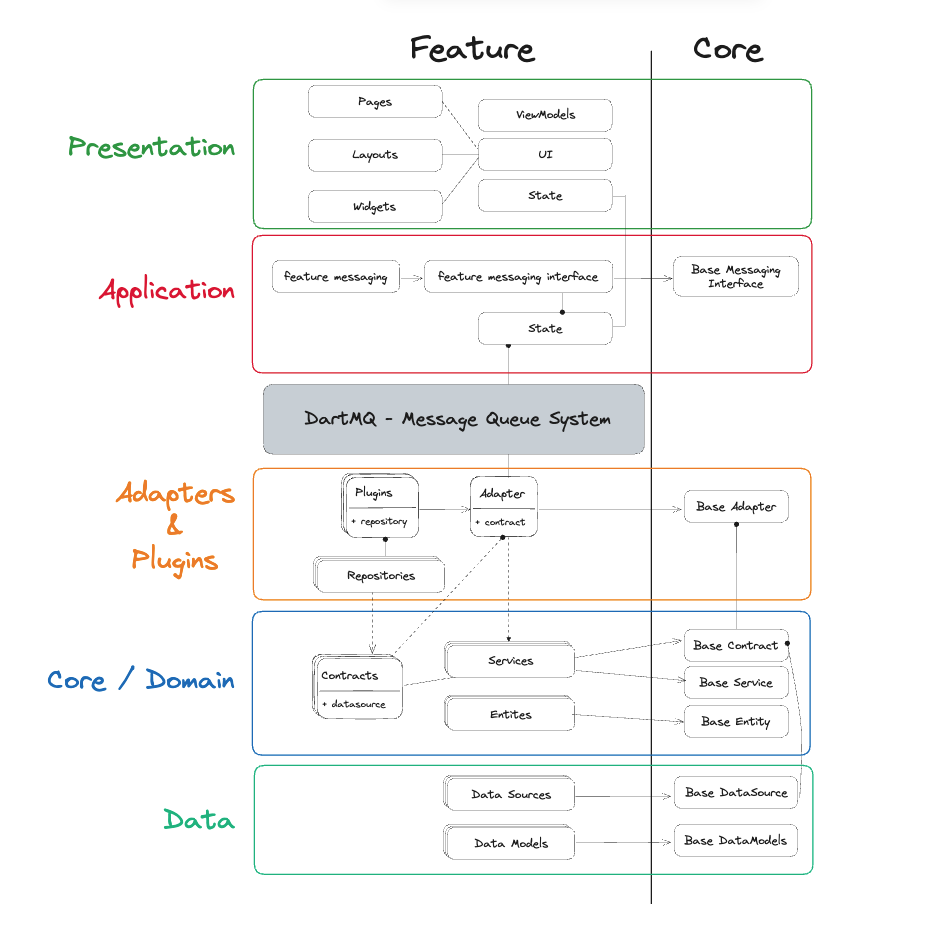
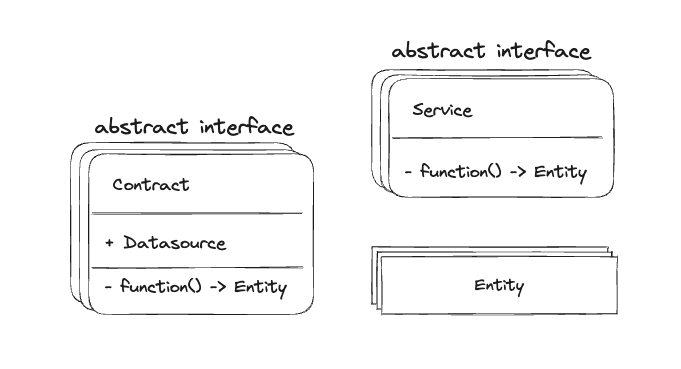
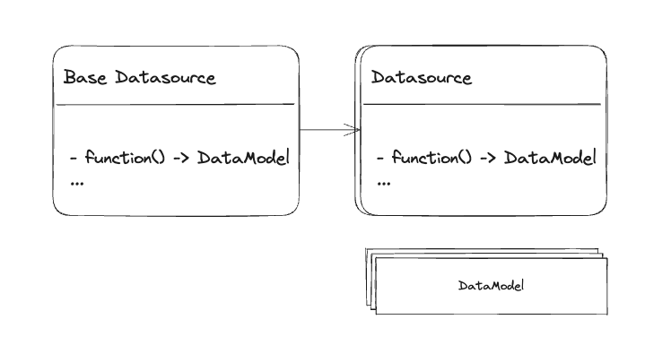
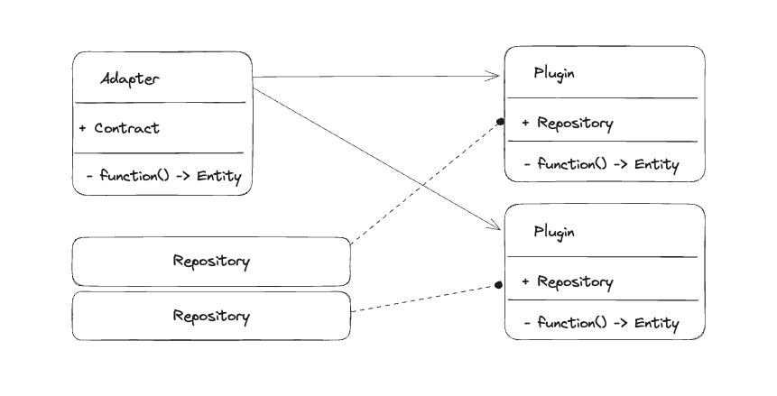
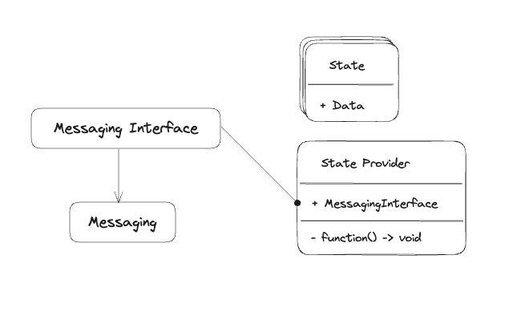
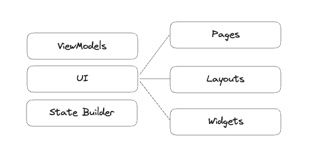
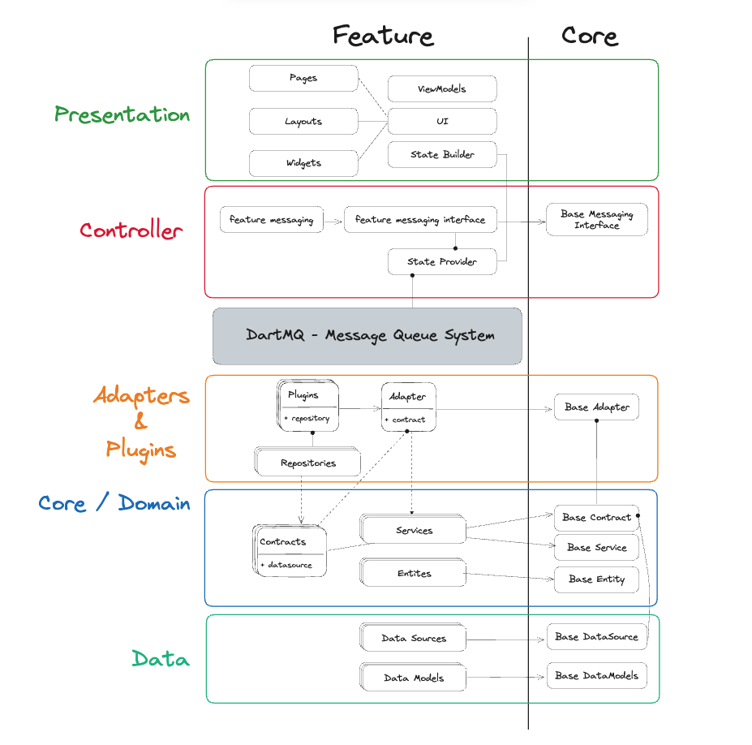

# Core-Plugin Architecture:

## Table of Contets:

- [Introduction](#introduction)
- [Current Challenges](#current-challenges)
- [Solution Goals](#solution-goals)
- [Architecture Overview](#architecture-overview)
- [Layers and Definitions](#layers-and-definitions)
- [Deep-dive](#deep-dive)
  - [Core Layer](#core-layer)
  - [Data Layer](#data-layer)
  - [Adapters / Plugins Layer](#adapters--plugins-layer)
  - [Controller Layer](#controller-layer)
  - [Presentation Layer](#presentation-layer)
- [Putting it all together](#putting-it-all-together)
- [Pros & Cons](#pros--cons)
- [DartMQ: Enhancing Service Communication](#dartmq-enhancing-service-communication)
- [Q&A](#qa)
- [Conclusion](#conclusion)

## Introduction:

Our journey to this new architecture was driven by a clear recognition of the challenges posed by the rapidly evolving requirements of Deriv's mobile applications. While the existing architecture remains serviceable, it has revealed limitations in flexibility, maintainability, and scalability as our app grew in complexity. These challenges have led to longer development cycles, increased technical debt, and potential bottlenecks when introducing new features or addressing user feedback promptly.

This document presents a proposal for a new architecture for all Dart/Flutter projects at Deriv. The primary goal of this architecture is to establish a codebase that is modular, testable, maintainable, and extensible. The document will delve into the architecture in detail and explore its pros and cons. Furthermore, it will outline how this architecture addresses the problems we encounter in our current architecture. Lastly, it will detail the implementation of this architecture in our ongoing projects.

## Current challenges:

Before we take a general look at the architecture, we will go over some of the challenges we are currently facing and how we can solve them:

- **Tight Coupling**: The current architecture is tightly coupled. This means that a change in one component can affect other components. This makes the codebase hard to maintain and test.

- **Low Testability**: Due to the tight coupling, it is hard to test the codebase. Components are not dependent on abstractions, which makes it hard to pass mocks and test the components in isolation.

- **Absence of Structure**: The codebase lacks well-defined boundaries and clear responsibilities for its components. New developers find it hard to comprehend the underlying structure and flow of the system.

- **Low Modularity**: There is no domain layer to define the business logic entities and services, which makes the designed components hard to reuse.

## Solution goals:

To effectively tackle the challenges highlighted earlier, the ultimate architectural solution should achieve the following objectives:

- **Incorporate a `Domain` Layer**: Introduce a distinct Domain layer to ensure clear separation of concerns and enhance overall organization.

- **Establish Well-Defined Boundaries and Responsibilities**: Define precise responsibilities and clear boundaries for each layer and component,

- **Enhance Cross-Service Communication**: Create a smoother cross-service communication system, minimizing unnecessary dependencies between services and ensuring seamless interactions.

- **Promote Modularity, Extensibility, and Reusability**: Create a modular design that supports easy extensibility and reusability, laying the foundation for future implementations.

## Architecture overview:

This `Core-Plugin` architecture incorporates components and methodologies from various other arhitecture systems, such as:

- `Clean Architecture.` (Clearly defined layers - Separation of concerns)
- `Micro-Kernel Architecture.` (Extensibility - Reusability)
- `Micro Front End Architecture.` (Modularity - Maintainability - Cross-Service communication)
- `Domain Driven Design.` (Modularity - Reusability - Testability)

...allowing us to make use of the best features of each of these architectures.

## Layers and Definitions:

Before we take a deep dive into the architecture and its components, we will take a look at the layers that make it up, and what is the function of that layer:

- Core / Domain layer:
  - Defining business logic entities, service interfaces, and repository contracts.

###

- Data layer:
  - Retrieving data from the server and transforming it into data models.

###

- Adapters and Plugins layer.
  - Implementing the services and repository contracts defined in the core/domain layer.

###

- Controller layer:
  - Utilize the plugins (defined in the previous layer) into more practical application components.

###

- Presentation layer:
  - UI Rendering, State Management and SDK initialization.

###

By knowing exactly what each layer does, we have the flexibility to design each layer in a way that is most suitable, for example, we can incorporate Atomic Design in our Presentation layer or use the classic Widget - Layout - Page design which is implemented currently in our applications. In addition to this flexibility, such a change (Presentation Layer Design) has minimal effect on the other layers of the architecture, which shows how independent each layer is.

## Deep-dive:

Now that we have a general idea of the architecture, we will take a deep dive into each layer and its components.

### Core Layer:

The core layer is responsible for defining business logic entities, service interfaces, and repository contracts.

- **Entities**: These are the data models used across the application.

- **Services**: These are abstract interfaces defining specific functionality within a given domain. For instance, `BasicLoginService`, `SocialLoginService`, and `OTPLoginService` represent distinct functionalities within the authentication domain. This domain-driven division facilitates the creation of adapters with custom functionality.

- **Repository Contracts**: These are the `data-fetching` methods required by specific services. For example, the `BasicLoginService` might require a `BasicLoginContract` containing a `login` method that returns a `UserEntity`.

##

### Data Layer:

This layer is responsible for retrieving data from the server and transforming it into data models. This layer encompasses two primary components:

- **Data Models**: These data models precisely represent the `json` responses from the server. They are typically generated using the `flutter_deriv_api` package.

- **Data Sources**: These classes are tasked with fetching data from either a `Remote` source or a `Local` one.

##

### Adapters / Plugins Layer:

This layer is responsible for implementing the services and repository contracts defined in the core/domain layer. The adapters/plugins layer comprises three main components:

- **Repository**: These are the implementations of the repository contracts defined in the core/domain layer. These are typically utilized by a plugin or plugins.

- **Adapters**: An adapter is essentially a wrapper around a service (or a set of services) from the core/domain layer. It provides a repository contract that aids in implementing this or these services.

- **Plugins**: Plugins extend adapters and offer repository implementations to achieve specific functionalities.

##

### Controller Layer

This layer is accountable for implementing the `plugins` (defined in the previous layer) into more practical application components. For instance, the `AuthenticationPlugin` might find implementation in an `AuthenticationCubit` or an `AuthenticationProvider`, based on the specific requirements of the client application.

Furthermore, this layer can abstract cross-service communication functionality from the subsequent layer. This abstraction enables the `Presentation Layer` to focus exclusively on UI and state management concerns.

- **State Provider**: This is a state management solution that is used to manage the state of the application. It can be a `Cubit`, `Provider`, `MobX` or any other state management solution.

- **Messaging Interface**: This is an interface that is used to communicate between services.

- **Messaging**: This is the implementation of the `Messaging Interface`. It can use `DartMQ`, `BlocManager` or any other cross-service communication solution.

##

### Presentation Layer:

This layer is mainly responsible for `UI Rendering`, `State Management` and `SDK initialization`.

- **State Builder**: This is a widget that is used to build the UI based on the state of the application.

- **UI**: This is the UI of the application. It can be built using `Atomic Design`, `Widget - Layout - Page` or any other UI design solution.

##

## Putting it all together:

As we have seen, each layer has its own components and responsibilities, allowing for a more modular, testable, maintainable and extensible codebase.

## Pros & Cons:

### Pros:

- **Modularity**: Each module is responsible for a specific functionality. This makes the code more readable and maintainable.

- **Testability**: Each module depends on an abstraction, which makes it easy to pass mocks and test the module in isolation.

- **Maintainability**: Having small components with minimal funtionality allows the code to be maintained easily. Developers can easily find what they are looking for and make changes accordingly w/o considering other modules being affected. (e.g. a bug in the `TradeService` can be fixed without affecting the `MarketsService`).

- **Extensibility**: Each module can be extended to fit custom needs. For example, the `AuthenticationAdapter` can be extended to fit the needs of a specific client application.

- **Reusability**: Components can be reused in other projects as long as the project has the same functionality. For example, the `AuthenticationAdapter` can be used in any project that requires basic authentication functionality.

### Cons:

- **Complexity**: Any architecture will add some complexity to the codebase. This architecture is no different. However, the benefits outweigh the complexity.

## DartMQ: Enhancing Service Communication

`DartMQ` serves as a fundamental tool for enabling communication between different services within our architecture. It operates on a straightforward "publish/subscribe" mechanism, providing a means for services to share information and react to changes. While its adoption is optional, it brings significant advantages to our system.

The messaging system within `DartMQ` offers two primary approaches:

- `Exchange and Queue Model (Similar to RabbitMQ)`: This model allows services to exchange messages through dedicated queues. It supports the broadcasting of messages to multiple services that are interested in specific topics, thus enhancing the efficiency of communication.

- `Topic and Queue Model (Similar to Kafka)`: In this model, services communicate through topics. Messages are categorized into topics, enabling more targeted communication between services, leading to more organized interactions.

Real-World Application:
To illustrate `DartMQ`'s impact, consider the interaction between the following services:

- `Market Price Service`: Updates real-time market data.
- `Trade Service`: Monitors market data changes and manages trades.
- `Notification Service`: Listens to trade updates and sends notifications to users.

Given the intricate dependency between these services, `DartMQ` comes to the rescue. It decouples these services, fostering independence. Through `DartMQ`, services can monitor each other's states and act accordingly, all without tight coupling.

Additionally, `DartMQ` supports the crucial aspect of `Remote Procedure Calls (RPC)` across services. For instance, in scenarios involving distributed transactions across services, `DartMQ` facilitates seamless communication, maintaining the integrity of our processes.

In essence, `DartMQ` significantly elevates our service communication capabilities, promoting agility, scalability, and modularity within our architecture.

## Q&A:

### Q: What is the difference between a `Plugin` and an `Adapter`?

- A `Plugin` is an implementation of an `Adapter`. For example, the `AuthenticationPlugin` is an implementation of the `AuthenticationAdapter`.

### Q: How will this architecture enhance testability?

- By promoting modularity and isolating components, we enable more effective testing, allowing components to be tested in isolation with the use of mocks and stubs.

### Q: How does the proposed architecture improve adaptability to new requirements?

- By implementing the Domain Layer and promoting modular design, we make it easier to adapt and extend components to meet new requirements.

### Q: Is DartMQ mandatory for this architecture?

- No, DartMQ is optional but recommended. It simplifies communication between services, enhancing system decoupling.

## Conclusion

As we have seen this architecture promotes writing clean code that meets a high standard of maintainability, scalability, testability and re-usability. In addition to this, this architecture is characterized by it's high level of flexibility, whether it was changing your communication method, state-management solution or swap your back-end datasources, none of these change affect the other components in the architecture, as long as you have well defined layer boundaries you are free to design each layer independantly.
