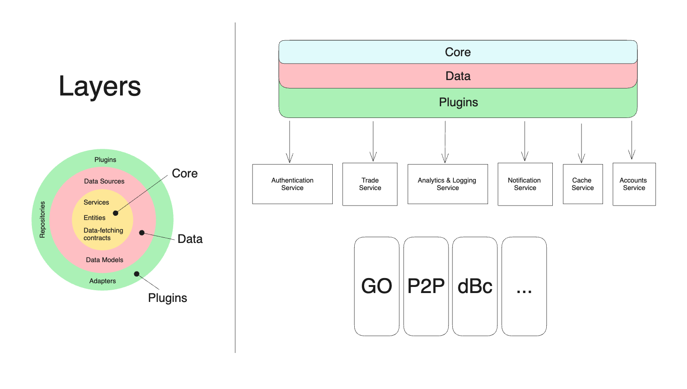

# Core-Plugin Architecture:

## Introduction:

Our journey to this new architecture was driven by a clear recognition of the challenges posed by the rapidly evolving requirements of Deriv's mobile applications. While the existing architecture remains serviceable, it has revealed limitations in flexibility, maintainability, and scalability as our app grew in complexity. These challenges have led to longer development cycles, increased technical debt, and potential bottlenecks when introducing new features or addressing user feedback promptly.

This document presents a proposal for a new architecture for all Dart/Flutter projects at Deriv. The primary goal of this architecture is to establish a codebase that is modular, testable, maintainable, and extensible. The document will delve into the architecture in detail and explore its pros and cons. Furthermore, it will outline how this architecture addresses the problems we encounter in our current architecture. Lastly, it will detail the implementation of this architecture in our ongoing projects.

<!-- Our journey to this new architecture was fueled by a clear recognition of the challenges posed by the rapidly evolving requirements of Deriv's mobile applications. The existing architecture, while serviceable, revealed limitations in flexibility, maintainability, and scalability as our app grew in complexity. These challenges translated into longer development cycles, increased technical debt, and potential bottlenecks when introducing new features or addressing user feedback promptly.

This document is a proposal for a new architecture for all Dart/Flutter projects in Deriv. The main goal of this architecture is to have a modular, testable, maintainable and extensible codebase. This document will explain the architecture in detail, and will also explain the pros and cons of this architecture. In addition, this document will explain how this architecture solves the problems that we are facing in our current architecture. Finally, this document will explain how this architecture can be implemented in our current projects. -->

## Diagram:

## Pros & Cons:

### Pros:

- **Modularity**: Each module is responsible for a specific functionality. This makes the code more readable and maintainable.

- **Testability**: Each module depends on an abstraction, which makes it easy to pass mocks and test the module in isolation.

- **Maintainability**: Having small components with minimal funtionality allows the code to be maintained easily. Developers can easily find what they are looking for and make changes accordingly w/o considering other modules being affected. (e.g. a bug in the `TradeService` can be fixed without affecting the `MarketsService`).

- **Extensibility**: Each module can be extended to fit custom needs. For example, the `AuthenticationAdapter` can be extended to fit the needs of a specific client application.

- **Reusability**: Components can be reused in other projects as long as the project has the same functionality. For example, the `AuthenticationAdapter` can be used in any project that requires basic authentication functionality.

### Cons:

- **Complexity**: Any architecture will add some complexity to the codebase. This architecture is no different. However, the benefits outweigh the complexity.

## Architecture Layers:

### Data Layer:

This layer is responsible for retrieving data from the server and transforming it into data models. This layer encompasses two primary components:

- **Data Models**: These data models precisely represent the `json` responses from the server. They are typically generated using the `flutter_deriv_api` package.

- **Data Sources**: These classes are tasked with fetching data from either a `Remote` source or a `Local` one.

### Domain/Core Layer

This layer is accountable for defining business logic entities, service interfaces, and repository contracts. The domain/core layer encompasses three primary components:

- **Entities**: These are the data models used across the application.

- **Services**: These are abstract interfaces defining specific functionality within a given domain. For instance, `BasicLoginService`, `SocialLoginService`, and `OTPLoginService` represent distinct functionalities within the authentication domain. This domain-driven division facilitates the creation of adapters with custom functionality.

- **Repository Contracts**: These are the `data-fetching` methods required by specific services. For example, the `BasicLoginService` might require a `BasicLoginContract` containing a `login` method that returns a `UserEntity`.

### Adapters / Plugins Layer

This layer is responsible for implementing the services and repository contracts defined in the core/domain layer. The adapters/plugins layer comprises three main components:

- **Repository Implementations**: These are the implementations of the repository contracts defined in the core/domain layer. These are typically utilized by a plugin or plugins.

- **Adapters**: An adapter is essentially a wrapper around a service (or a set of services) from the core/domain layer. It provides a repository contract that aids in implementing this or these services.

- **Plugins**: Plugins extend adapters and offer repository implementations to achieve specific functionalities.

### Application Layer

This layer is accountable for implementing the `plugins` (defined in the previous layer) into more practical application components. For instance, the `AuthenticationPlugin` might find implementation in an `AuthenticationCubit` or an `AuthenticationProvider`, based on the specific requirements of the client application.

Furthermore, this layer can abstract cross-service communication functionality from the subsequent layer. This abstraction enables the `Presentation Layer` to focus exclusively on UI and state management concerns.

> Side note: DartMQ is a message queue system that can be used to communicate between services. It's a simple pub/sub implementation that can be used to communicate between services. It's not a requirement, but it's a nice-to-have.

### Presentation Layer:

This layer is mainly responsible for `UI Rendering`, `State Management` and `SDK initialization`.

## Example in Practice

### Requirement:

Develop two applications enabling users to track market status and prices across various markets, anytime.

#### Step 1: Establish the `BASE` Components:

BaseEntity - BaseService - BaseContract - BaseDataModel - BaseDataSource

These foundational `BASE` classes serve as blueprints for our components, defining their type and functionality.

#### Step 2: Create a `DOMAIN` Folder:

MarketDataService - abstract mixin - exposes a watchMarkets function returning a `stream` of data to the application.

PriceTickEntity - final - stores data for a single price tick in a market (quote, bid, epoch..).

MarketEntity - final - encompasses market information (name, symbol, open/closed status..).

MarketSubscriptionContract - abstract interface - outlines a subscribe function for accessing market websockets from the API. Requires a Datasource for data retrieval.

#### Step 3: Create the `DATA` Layer:

MarketDataModel - final - translates JSON responses into practical Dart classes.

MarketDatasource - final- subscribes to API endpoints, returning streams of MarketDataModel.

#### Step 4: Create the `PLUGINS` layer:

MarketDataRepository - final - implements MarketeSubscriptionContract - wires the functionality to the MarketDatasource.

MarketDataAdapter - abstract base - usees MarketDataService - depends on MarketDataContract to provide functionality.

MarketDataPlugin - final - extends MarketDataAdapter - wire the functionality with MarketDataRepository.

> Side note: If you are reading this, you are probably way too engaged in this. Is everything ok?

#### Step 5: Create the `APPLICATION` layer:

With a functional plugin in hand, it's time to tailor it to the specific application's needs. For instance, the first application's application layer might host a `BLoC` component for state management, while the second application employs the same plugin within a `MobX` store.` store.

#### Step 6: Create your `UI` layer:

No guidance needed here.

## Q&A

- **Q: How can I add an authentication feature?**
  - **A:** No need to recreate the `BASE` classes. Simply repeat steps 2-4 to create the necessary components. Afterward, you're free to use the plugin in any application you choose.

---

- **Q: How would you handle cross-service communication for allowing only `authorized` users to view market data?**
  - **A:** Utilize DartMQ. Each feature's application layer should manage the communication logic. For instance, send an `authenticated` or `not-authenticated` message on the `AuthenticationStatus` topic in the message broker. Listen to it where appropriate and respond accordingly.

---

- **Q: What if I'm not keen on using DartMQ?**
  - **A:** It'll grow on you, just give it some time . Alternatively, since DartMQ isn't a core architectural element, you have the flexibility to replace it with any other cross-service communication solution that aligns with your preferences and needs.

## Conclusion

As we have seen this architecture promotes writing clean code that meets a high standard of maintainability, scalability, testability and re-usability. In addition to this, this architecture is characterized by it's high level of flexibility, whether it was changing your communication method, state-management solution or swap your back-end datasources, none of these change affect the other components in the architecture, as long as you have well defined layer boundaries you are free to design each layer independantly.
