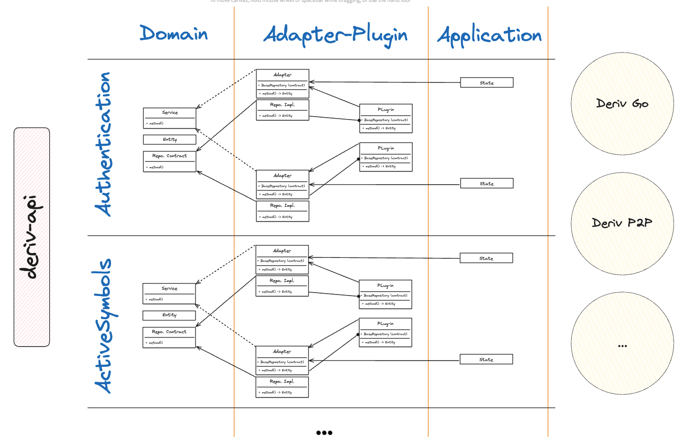

# Core-Adapters-Plugins Architecture:

## Layers and definitions:

- **Data Layer**: The data layer is the `flutter-deriv-api` package. It contains the data models and the API calls to the server that we need and the need for a wrapper around it seemed unnecessary.

- **Domain/Core Layer**: This layer hold 3 main components:

  - Entities: Data models that are used across the application.
  - Services: Abstract interface that defines certain functionality within that specific domain. For example, `BasicLoginService`, `SocialLoginService` and `OTPLoginService` are all different functionalities in the authentication domain. This division by `use-case` will help when creatting adapters with custom functionality.
  - Repository contracts: This defins the `data-fetching` methods that a certain service might require.

 

- **Adapters / Plugins Layer**: This can be further divided into two layers:

  - Adapters: An adapter is nothing but a wrapper around a service (or services) from the domain, and provides a repository contract that wil help implements this/these services.
  - Plugins: A plugin extends an adapter, and provides a repository implementation to achieve that functionality.

From here we can take these adapters and use them in our `Deriv Go` and `Deriv P2P` apps (weather inside state management solutions or any other way, but please, no injection, it's not cool).

- **Appication Layer**: This layer is extracted from the application, and is divided by domain functionality like all other layers. This extraction helps with maintainability, testability, reusability of inividual components. This layer can hold `logic`, `logic + state` or `logic + state + ui` depending on what is needed from a specific feature.

- **Client Application**: These are our `Deriv Go`, `Deriv P2P` and any other Deriv app that we might have in the future. Each client app with contain the `runApp` function, flavoring, SDK initialization and could contain any non-logically-complex code required.

## Notable properties:

- **Extensibility**:

  - One core many adapters.
  - One adapter many plugins.
  - One plugin multiple application wrappers (cubit and provider for example).

 

- **Maintainability**: Having small components with minimal funtionality allows the code to be maintained easily. Developers can easily find what they are looking for and make changes accordingly w/o considering other modules being affected. (e.g. a bug in the `BasicLoginService` can be fixed without affecting the `SocialLoginService`).

- **Flexibility**: Layers can be added or removed as long as module functionality is well-defined. Initially, adapters and cores were in the same layer, but now adapters and plugins are in the same layer. There were some propsals to have a UI layer between the application and the client application, which is possible. In addition, each component can be individually tweaked to fit custom needs. (some components need more focus on security, other need more focus on performance, etc.)

- **Testability**: most components depend on contracts (abstractions), which makes passing mocks easy and testing the components in isolation possible.

- **Reusability**: Components can be reused in other projects as long as the project has the same functionality. For example, the `BasicLoginAdapter` can be used in any project that requires basic login functionality

## What it solves?

It's not the architecture that solves the problem, the solution is actually a sum of solutions:

- Loose coupling between components. Enhances testability and maintainability. Developers can change any module without affecting any other module.

- Separation of concerns. Each module has a specific functionality and is responsible for that functionality only. This makes the code more readable and maintainable.

- Abstraction. Each module depends on an abstraction, which makes it easy to pass mocks and test the module in isolation.

... among other mini-solutions.

This proposed architecture facilitates the implementation of the above solutions.
